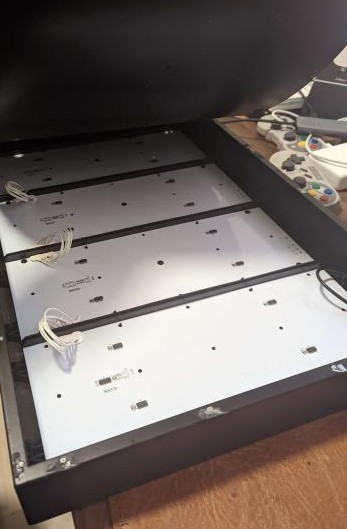
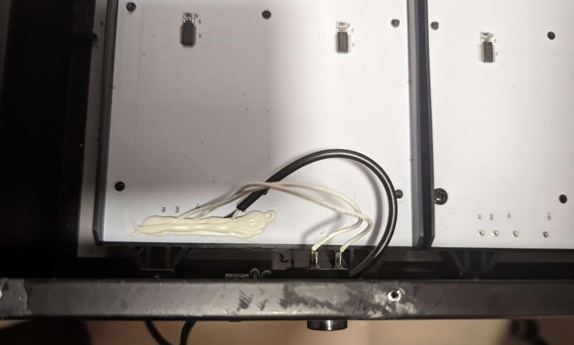
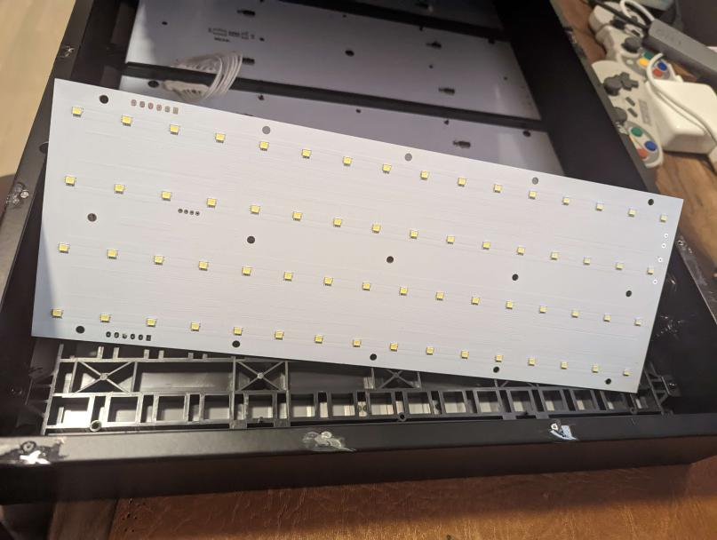
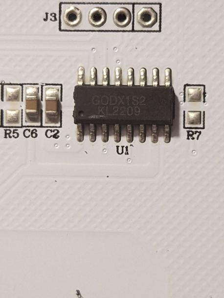
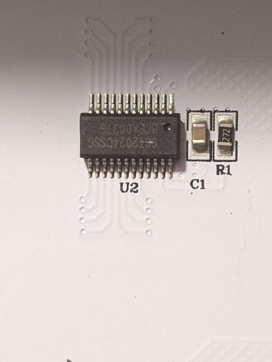
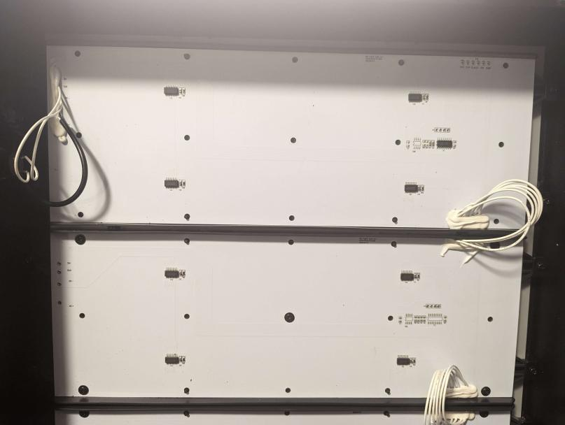
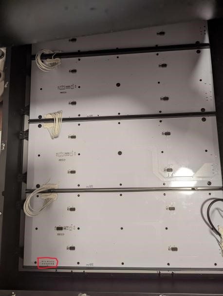

# OBEGRÄNSAD LED Lamp

## Background

IKEA created a LED lamp together with a Swedish band called Swedish House Mafia called [OBEGRÄNSAD](https://www.ikea.com/se/sv/p/obegraensad-led-vaegglampa-svart-00526248/).

It functioned like a large LED matrix, showing repeating patterns.

When you press the switch on the side it changes pattern.

Unlike [FREKVENS](https://www.ikea.com/se/sv/p/frekvens-led-multibelysning-svart-30420354/), their smaller LED matrix that were created together with Teenage Engineering, a Swedish company making electronic products in the sound and music sphere, OBEGRÄNSAD is fully passive. FREKVENS has a microphone as to adjust the pattern to the music.

But the size and the microphone is the only difference between these two products at a quick glance, so hopefully having some knowledge how to rebuild FREKVENS will help me with OBEGRÄNSAD.

## Teardown

OBEGRÄNSAD is more difficult than normal to open up. It has rivets all around the sides holding the backpanel in place.

Inside we see 4 LED panels that are chained with the first one connecting to the side-button and power.



On the side there is one button and a USB kabel.



The front of the panel with it's 4x16 LED matrix.



The panel itelf have the following information printed on it:

```
HE-GQDX-LED-A2
L320*W140*T1.0MM
20210712
```

A quick search for HE-GQDX-LED-A2 returns nothing, which have been the case with a lot of IKEA products.

The other information is most likely Length, Width, Thickness and manufacturing date.


This chip only appears on the first panel and is marked with:

```
GODX1S2
KL2209
```

It has two capicators next to it, the remaining pads are not populated.
The chip seems yet again custom made as I can not find any information about it online.




All panels have four SCT2024 chip, it is marked with:

```
SCT2024CSSG
BCEA00376
```

This is a known chip, created by Starchips Technology Inc.

They specalize in LED displays and LED lighting driver technology.

On their website we can find the datasheet for the chip.

[SCT2024 Data sheet](http://www.starchips.com.tw/pdf/datasheet/SCT2024V01_03.pdf)

Here we can also see that the SCT2024 chip comes in four different configurations. What we have is the CSSG configuration.






## Planned modifications

While cycling through the different modes of the LED lamp, there is a off mode where no LED's are turned on, but hopefully power is still being supplied to all the chips.

This way we should be able to hock on our own chip at the top of first panel (showin in red in the picture).



This should power it with 5V and enable it to send serial data to all the SCT2024.

If that is all we would need to do, we could cut open a "small" hole at the bottom, solder on a pin connector, connect our IC of choice to those and attach a switch on the 5V so we can turn it off if we want the original functionality back.


## Final thougts

If I were to do this modification again I would just cut out a hole above the first panel to access the microcontroller I need to replace instead of cutting off all the rivets.